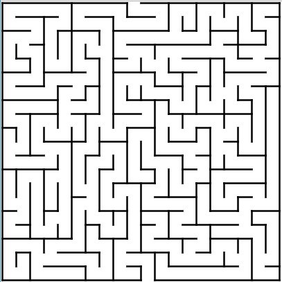
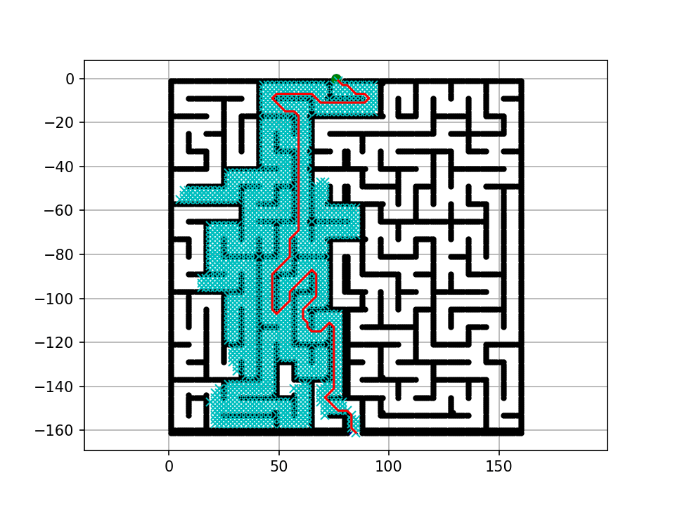

# 🗺️ A* Maze Path Planning

[](https://www.python.org/)
[](https://opencv.org/)
[](https://matplotlib.org/)
[](LICENSE)

> **Intelligent maze solver using A* pathfinding algorithm with animated visualization and GIF export**

Find the shortest path through complex mazes using the A* search algorithm with real-time visualization.

---

## 📸 Demo

<div align="center">
  
  
  <p><em>Left: Input maze image | Right: A* pathfinding in action (GIF output)</em></p>
</div>

**Features in Action:**
- ⚡ Real-time pathfinding visualization
- 🎯 Shortest path guarantee (A* optimality)
- 🎬 Animated GIF export
- 🖼️ Image-based maze loading

---

## 🎯 Key Features

- 🔍 **A* Algorithm** - Optimal pathfinding with heuristic search
- 🖼️ **Image-Based Mazes** - Load mazes directly from PNG images
- 📊 **Real-Time Visualization** - Watch the algorithm explore the search space
- 🎬 **GIF Animation** - Export pathfinding process as animated GIF
- ⚙️ **Configurable Parameters** - Adjust grid size, robot radius, start/goal positions
- 🎨 **Matplotlib Visualization** - Beautiful, publication-ready plots
- 🚀 **Fast Performance** - Efficient implementation with optimized data structures

---

## 🚀 Quick Start

### Installation

```bash
# Clone repository
git clone https://github.com/AmirHosseinOsooli/Maze-path-planning.git
cd maze-path-planning

# Install dependencies
pip install -r requirements.txt
```

### Run the Maze Solver

```bash
# Navigate to src directory
cd src

# Run with default maze
python maze.py
```

**Output:**
- Real-time visualization window
- `a_star_animation.gif` - Animated pathfinding process
- Console output showing search progress

---

## 📖 How It Works

### A* Algorithm Overview

A* (A-star) finds the shortest path by combining:
- **g(n)**: Actual cost from start to current node
- **h(n)**: Heuristic estimate to goal (Euclidean distance)
- **f(n) = g(n) + h(n)**: Total estimated cost

**Properties:**
- ✅ **Complete**: Always finds solution if exists
- ✅ **Optimal**: Guarantees shortest path
- ✅ **Efficient**: Uses heuristic to guide search
- ✅ **Informed**: Better than blind search

### Workflow

```
┌─────────────────┐
│  Load Maze PNG  │
└────────┬────────┘
         │
         ▼
┌─────────────────┐
│ Convert to Grid │  (Black pixels = obstacles)
└────────┬────────┘
         │
         ▼
┌─────────────────┐
│ Initialize A*   │  (Set start & goal)
└────────┬────────┘
         │
         ▼
┌─────────────────┐
│   Find Path     │  (A* search algorithm)
└────────┬────────┘
         │
         ▼
┌─────────────────┐
│ Animate Result  │  (Real-time + GIF export)
└─────────────────┘
```

---

## 💡 Usage Examples

### Example 1: Run with Default Settings

```python
# src/maze.py
python maze.py
```

**Parameters:**
- Start: (76.0, 0.0)
- Goal: (84.0, -160.0)
- Grid size: 2.0
- Robot radius: 1.0

---

### Example 2: Custom Maze Image

```python
from maze import image_to_obstacles
from a_star import AStarPlanner
import matplotlib.pyplot as plt

# Load your maze
ox, oy = image_to_obstacles("your_maze.png", grid_size=2.0)

# Initialize planner
planner = AStarPlanner(ox, oy, grid_size=2.0, robot_radius=1.0)

# Find path
rx, ry = planner.planning(
    sx=10.0, sy=10.0,     # Start position
    gx=50.0, gy=50.0      # Goal position
)

# Visualize
plt.plot(ox, oy, ".k")  # Obstacles
plt.plot(rx, ry, "-r")   # Path
plt.show()
```

---

### Example 3: Standalone A* (No Image)

```python
from a_star import AStarPlanner
import matplotlib.pyplot as plt

# Create simple obstacles
ox, oy = [], []

# Boundaries
for i in range(-10, 60):
    ox.append(i)
    oy.append(-10.0)
# ... (add more obstacles)

# Run A*
planner = AStarPlanner(ox, oy, grid_size=2.0, robot_radius=1.0)
rx, ry = planner.planning(10.0, 10.0, 50.0, 50.0)

# Plot
plt.plot(ox, oy, ".k")
plt.plot(rx, ry, "-r")
plt.show()
```

---

## 🎮 Configuration Parameters

### Maze Loading

| Parameter | Type | Default | Description |
|-----------|------|---------|-------------|
| `image_path` | str | "maze.png" | Path to maze PNG image |
| `grid_resolution` | float | 2.0 | Grid cell size (affects resolution) |

**Image Requirements:**
- Format: PNG (grayscale or color)
- Black pixels (RGB < 128) = Obstacles
- White pixels (RGB ≥ 128) = Free space

---

### Pathfinding Parameters

| Parameter | Type | Default | Description |
|-----------|------|---------|-------------|
| `sx, sy` | float | 76.0, 0.0 | Start position (x, y) |
| `gx, gy` | float | 84.0, -160.0 | Goal position (x, y) |
| `grid_size` | float | 2.0 | Resolution of search grid |
| `robot_radius` | float | 1.0 | Collision buffer radius |

---

### Visualization Settings

| Parameter | Type | Default | Description |
|-----------|------|---------|-------------|
| `show_animation` | bool | True | Display real-time search |
| `save_gif` | bool | True | Export animation to GIF |
| `fps` | int | 10 | GIF frames per second |
| `interval` | int | 100 | Animation update interval (ms) |

---

## 📁 Repository Structure

```
maze-path-planning/
├── src/
│   ├── a_star.py              # A* algorithm implementation
│   └── maze.py                # Maze solver with image loading
├── examples/
│   └── maze_input.png         # Sample maze image
├── assets/
│   └── a_star_animation.gif   # Example output (generated)
├── docs/
│   ├── ALGORITHM.md           # Detailed algorithm explanation
│   └── EXAMPLES.md            # More usage examples
├── requirements.txt           # Python dependencies
├── README.md                  # This file
├── LICENSE                    # MIT License
└── .gitignore                 # Git exclusions
```

---

## 🔧 Requirements

```txt
numpy>=1.21.0
opencv-python>=4.5.0
matplotlib>=3.4.0
Pillow>=8.0.0
```

**Install all:**
```bash
pip install -r requirements.txt
```

---

## 📊 Algorithm Details

### Motion Model (8-Direction Movement)

```python
# [dx, dy, cost]
motion = [
    [1, 0, 1],           # Right
    [0, 1, 1],           # Up
    [-1, 0, 1],          # Left
    [0, -1, 1],          # Down
    [-1, -1, √2],        # Diagonal: Down-Left
    [-1, 1, √2],         # Diagonal: Up-Left
    [1, -1, √2],         # Diagonal: Down-Right
    [1, 1, √2]           # Diagonal: Up-Right
]
```

**Why √2 for diagonals?**
- Euclidean distance: diagonal = √(1² + 1²) = √2 ≈ 1.414

---

### Heuristic Function

**Euclidean Distance:**
```python
h(n) = w * √((x₁ - x₂)² + (y₁ - y₂)²)
```

Where:
- `w = 1.0` (heuristic weight)
- Guarantees optimality when w ≤ 1.0

---

### Complexity Analysis

| Metric | Complexity | Notes |
|--------|-----------|-------|
| **Time** | O(b^d) | b = branching factor, d = depth |
| **Space** | O(b^d) | Stores open and closed sets |
| **Optimality** | ✅ Guaranteed | With admissible heuristic |
| **Completeness** | ✅ Yes | Always finds solution if exists |

---

## 🎨 Creating Your Own Maze

### Option 1: Draw in Image Editor

1. **Open image editor** (Paint, Photoshop, GIMP, etc.)
2. **Create new image** (e.g., 500x500 pixels)
3. **Draw maze**:
   - Black color (#000000) = Walls/Obstacles
   - White color (#FFFFFF) = Free space
4. **Save as PNG** in `examples/` folder
5. **Update maze.py**:
   ```python
   maze_image_path = "your_maze.png"
   ```

### Option 2: Programmatically Generate

```python
import cv2
import numpy as np

# Create blank image
img = np.ones((500, 500), dtype=np.uint8) * 255

# Draw walls (black lines)
cv2.rectangle(img, (100, 100), (400, 400), 0, 5)
cv2.line(img, (100, 250), (400, 250), 0, 5)

# Save
cv2.imwrite("custom_maze.png", img)
```

---

## 🐛 Troubleshooting

### Issue: "Open set is empty"

**Cause:** No path exists between start and goal

**Solutions:**
1. Check start/goal are in free space (white area)
2. Ensure they're not inside obstacles (black area)
3. Reduce `robot_radius` to fit through narrow passages
4. Verify image is loaded correctly (check for inversion)

---

### Issue: Path goes through walls

**Cause:** `robot_radius` is too small

**Solution:**
```python
robot_radius = 2.0  # Increase to add safety margin
```

---

### Issue: Very slow performance

**Cause:** High-resolution grid or large maze

**Solutions:**
1. **Increase grid_size** (coarser resolution):
   ```python
   grid_size = 5.0  # Faster but less accurate
   ```

2. **Simplify maze** (fewer obstacles)

3. **Reduce image size before processing**

---

### Issue: Animation window doesn't show

**Cause:** Backend not properly configured

**Solution:**
```python
import matplotlib
matplotlib.use('TkAgg')  # Add before import pyplot
import matplotlib.pyplot as plt
```

**Alternative backends:**
- `'Qt5Agg'` - If you have PyQt5
- `'MacOSX'` - For macOS
- `'Agg'` - No window (save only)

---

### Issue: GIF not saving

**Cause:** Missing Pillow writer

**Solution:**
```bash
pip install Pillow --upgrade
```

---

## 📈 Performance Tips

### 1. Grid Resolution Trade-off

```python
# Fine grid (slow, accurate)
grid_size = 0.5  # High resolution
# Result: Smoother paths, slower computation

# Coarse grid (fast, approximate)
grid_size = 5.0  # Low resolution
# Result: Rougher paths, faster computation
```

**Recommendation:** Start with `grid_size = 2.0` and adjust

---

### 2. Robot Radius Optimization

```python
# Tight fit (may get stuck)
robot_radius = 0.5

# Safe margin (recommended)
robot_radius = 1.0

# Extra safe (for uncertain maps)
robot_radius = 2.0
```

---

### 3. Animation Control

```python
# Faster visualization
interval = 50  # ms between frames

# Save without animation
show_animation = False
save_gif = True
```

---

## 🔬 Algorithm Comparison

| Algorithm | Time | Space | Optimal | Complete |
|-----------|------|-------|---------|----------|
| **A*** | O(b^d) | O(b^d) | ✅ Yes | ✅ Yes |
| Dijkstra | O(b^d) | O(b^d) | ✅ Yes | ✅ Yes |
| Greedy BFS | O(b^m) | O(b^m) | ❌ No | ❌ No |
| BFS | O(b^d) | O(b^d) | ✅ Yes* | ✅ Yes |
| DFS | O(b^m) | O(bm) | ❌ No | ❌ No |

*BFS optimal only for unweighted graphs

**Why choose A*?**
- ✅ Optimal path guaranteed
- ✅ Faster than Dijkstra (guided by heuristic)
- ✅ More reliable than Greedy BFS
- ✅ Memory efficient for grid maps

---

## 🤝 Contributing

Contributions welcome! Areas for improvement:

### High Priority
- [ ] Add Theta* algorithm (any-angle paths)
- [ ] Implement D* Lite (dynamic replanning)
- [ ] Support for 3D mazes
- [ ] Path smoothing post-processing
- [ ] Interactive GUI for drawing mazes

### Medium Priority
- [ ] Multi-goal path planning
- [ ] Real-time obstacle detection
- [ ] Parallel processing for large mazes
- [ ] Alternative heuristics (Manhattan, Octile)
- [ ] RRT* comparison

### Low Priority
- [ ] Web-based visualization
- [ ] Mobile app version
- [ ] Maze generation algorithms
- [ ] Performance benchmarking suite

### How to Contribute

1. Fork the repository
2. Create feature branch (`git checkout -b feature/AmazingFeature`)
3. Commit changes (`git commit -m 'Add Theta* algorithm'`)
4. Push to branch (`git push origin feature/AmazingFeature`)
5. Open Pull Request

---

## 📖 References & Credits

### Original Implementation
- **A* Core Algorithm**: [PythonRobotics by Atsushi Sakai](https://github.com/AtsushiSakai/PythonRobotics)
- **Author**: Atsushi Sakai ([@Atsushi_twi](https://twitter.com/Atsushi_twi))
- **Contributor**: Nikos Kanargias (nkana@tee.gr)

### Animation
- **GIF Export**: [Matplotlib Animation Examples](https://matplotlib.org/stable/gallery/animation/simple_scatter.html)
- **Technique**: Animated scatter saved as GIF

---

## 📄 License

This project is licensed under the **MIT License** - see [LICENSE](LICENSE) file.

```
MIT License

Copyright (c) 2026 Maze Path Planning Project

Based on PythonRobotics by Atsushi Sakai
https://github.com/AtsushiSakai/PythonRobotics
```

---

## 🙏 Acknowledgments

- **Atsushi Sakai** - Original A* implementation
- **Nikos Kanargias** - Algorithm improvements
- **PythonRobotics** community - Testing and feedback
- **Matplotlib** team - Visualization framework
- **OpenCV** team - Image processing tools

---

## 📞 Support

- 🐛 **Issues**: [GitHub Issues](https://github.com/AmirHosseinOsooli/Maze-path-planning/issues)
- 💬 **Discussions**: [GitHub Discussions](https://github.com/AmirHosseinOsooli/Maze-path-planning/discussions)
- 📖 **Documentation**: [docs/ALGORITHM.md](docs/ALGORITHM.md)
- 📧 **Email**: your.email@example.com

---

## 🎓 Educational Use

This project is perfect for:
- 🎓 **Computer Science courses** - AI, Algorithms, Robotics
- 🔬 **Research projects** - Path planning, Navigation
- 📚 **Learning A*** - Visual, interactive implementation
- 🤖 **Robotics projects** - Mobile robot navigation
- 🎮 **Game development** - NPC pathfinding

---

<div align="center">

## 🗺️ Happy Path Planning!

[](https://www.python.org/)
[](https://opencv.org/)
[](LICENSE)

**[Examples](#usage-examples)** • **[Documentation](docs/ALGORITHM.md)** • **[Contributing](#contributing)**

**Version 1.0.0** | **2026** | **MIT License**

⭐ **Star this repo if you find it useful!**

---

*Find the shortest path through any maze with A* - Optimal, Fast, Visual*

</div>
